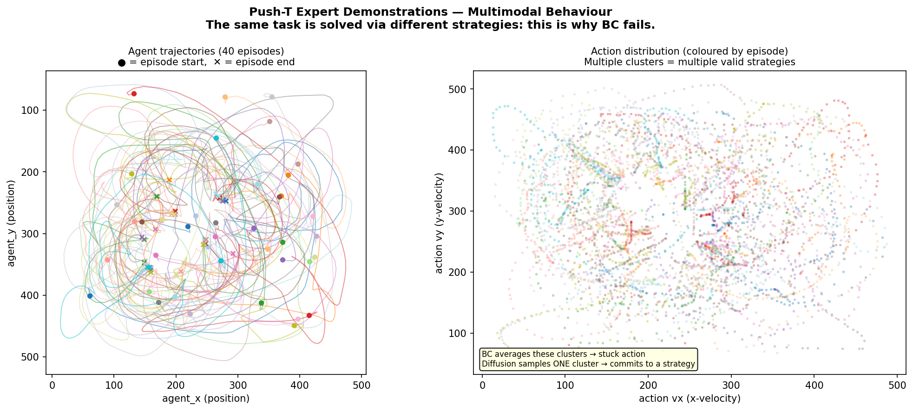
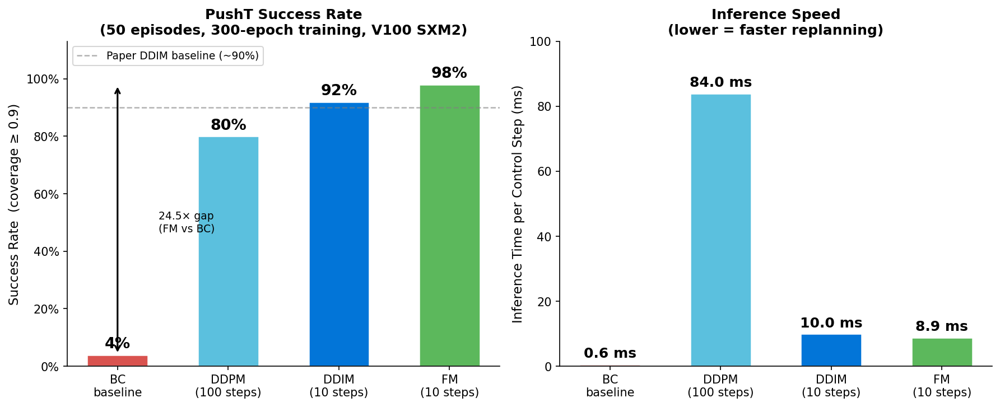
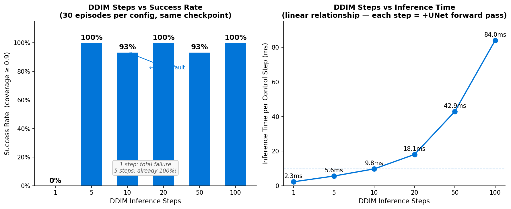
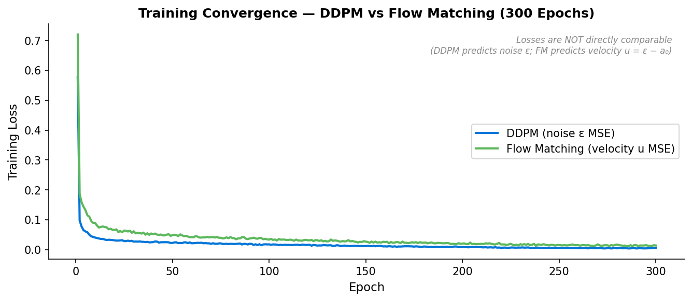

# Diffusion Policy for Robot Control

**ML 6140 — Machine Learning | Northeastern University | April 2026**  
Team: Yashvardhan Gupta · Vineeth Sakhamuru · Sai Krishna Reddy Maligireddy

---

## What is this?

A from-scratch implementation of [Diffusion Policy](https://arxiv.org/abs/2303.04137) (Chi et al., RSS 2023) applied to **PushT** — a 2D robot manipulation task where an agent must push a T-shaped block onto a target pose.

The central question: **why does standard supervised learning fail at robot control, and how does diffusion fix it?**

---

## The Problem — Why BC Fails

Expert demonstrations are **multi-modal**: from the same robot position, an expert might push left *or* right — both valid strategies. A standard MLP (behavioral cloning) averages these into a "middle" action that commits to neither, leaving the robot stuck.



> **Left:** Expert trajectories show two distinct approach strategies (left-side push, right-side push).  
> **Right:** The action distribution is bimodal. BC averages the clusters → stuck. Diffusion samples one cluster → commits.

---

## Results



| Method | Success Rate | Mean Coverage | Inference Time | Steps |
|--------|-------------|---------------|----------------|-------|
| **Flow Matching** (ours) | **98%** | 0.989 | 8.9 ms | 10 |
| **DDIM** (ours) | **92%** | 0.969 | 10 ms | 10 |
| **DDPM** (ours) | **80%** | 0.830 | 84 ms | 100 |
| **BC baseline** (ours) | **4%** | 0.241 | 0.6 ms | — |
| DDIM (Chi et al., 2023) | ~90% | — | — | 10 |

All diffusion methods are trained for 300 epochs on NVIDIA V100 SXM2 via Northeastern Explorer HPC. BC trained for 200 epochs. Evaluated over 50 episodes each.

---

## DDIM Steps Ablation

The same trained model can run with fewer denoising steps at inference time — no retraining needed.



| Steps | Success | Time | Insight |
|-------|---------|------|---------|
| 1 | 0% | 2.3 ms | Total failure — proves iterative denoising is real |
| **5** | **100%** | 5.6 ms | Full performance at 2× default speed |
| 10 | 93% | 9.8 ms | ← our default |
| 20 | 100% | 18 ms | Marginal gain, 2× cost |
| 100 | 100% | 84 ms | Same cost as full DDPM |

---

## Training Convergence



> Both models trained with AdamW (lr=1e-4), cosine decay, 500-step linear warmup. Losses are not directly comparable — DDPM predicts noise ε; FM predicts velocity u = ε − a₀.

---

## Architecture

The core model is a **1D temporal U-Net** that treats the action sequence like a 1D audio signal and applies an encoder-decoder to predict noise (DDPM) or velocity (FM).

```
Observation history  (T_obs=2 × obs_dim=5 = 10 values)
    → obs_embedding  (256-dim via 2-layer MLP)

Diffusion timestep k
    → timestep_embedding  (256-dim via SinusoidalPosEmb + MLP)

conditioning = concat(obs_embedding, timestep_embedding)  → 512-dim

Action sequence (16, 2)  treated as 1D signal (C=2, L=16)

Down:  2→256→512→1024  (3 levels, 2 ResBlocks each, halving length)
Up:    1024→512→256→2  (skip connections from down path)
Each ResBlock uses FiLM conditioning: γ(cond)·x + β(cond)

Output: (16, 2) = predicted noise ε  or velocity u
```

**68.95M parameters** | FiLM conditioning at every layer | EMA decay = 0.995

---

## How Diffusion Works (in 3 steps)

1. **Forward process** — gradually corrupt an action sequence with Gaussian noise over K=100 steps until it's pure noise
2. **Training** — teach the U-Net to predict what noise was added at any step (or what velocity to travel in FM)  
3. **Inference** — start from pure noise, call the U-Net 10-100 times, iteratively denoise to get a clean action sequence

Each inference run from the **same observation** can produce a **different valid action** — this is how diffusion handles multi-modal expert behavior without mode averaging.

---

## Repository Structure

```
.
├── config.py                  # All hyperparameters in one dataclass
├── train.py                   # DDPM / Flow Matching training
├── train_bc.py                # BC baseline training
├── evaluate.py                # Receding-horizon evaluation (DDPM/DDIM/FM)
├── evaluate_bc.py             # BC evaluation
├── ablation.py                # DDIM steps sweep [1,5,10,20,50,100]
├── visualize.py               # All plots and GIF generation
├── run_ablation.sh            # Local 6-phase orchestration
├── requirements.txt
├── ARCHITECTURE.md            # Deep technical reference
├── PROJECT_REPORT.md          # Full report: math, results, challenges
│
├── baselines/
│   └── bc_policy.py           # 2-hidden-layer MLP (135K params)
│
├── diffusion_policy/
│   ├── model/
│   │   ├── unet1d.py          # ConditionalUnet1D — 68.95M params, FiLM
│   │   ├── ddpm.py            # Cosine noise schedule, reverse process
│   │   ├── ddim.py            # Deterministic skip-step sampler
│   │   ├── ema.py             # Exponential Moving Average (decay=0.995)
│   │   ├── flow_matching.py   # Straight-line ODE (velocity prediction)
│   │   └── vision_encoder.py  # ResNet-18 (image observations, optional)
│   ├── data/
│   │   ├── dataset.py         # Zarr loading + sliding-window sampling
│   │   ├── normalizer.py      # MinMaxNormalizer → [-1, 1]
│   │   └── image_dataset.py   # Image dataset (visuomotor extension)
│   └── env/
│       └── pusht_env.py       # Gymnasium PushT wrapper
│
├── hpc/                       # Northeastern Explorer SLURM scripts
│   ├── setup_env.sh           # Create isolated diffpol conda env
│   ├── train_ddpm.sh          # 300-epoch DDPM (V100, courses-gpu)
│   ├── train_fm.sh            # 300-epoch FM (V100, courses-gpu)
│   ├── train_bc.sh            # 200-epoch BC
│   ├── ablation_steps.sh      # DDIM steps ablation
│   └── watch_and_submit_ablation.sh
│
├── results/                   # Evaluation JSON results (git-tracked)
│   ├── bc_50eps.json          # BC:   4%  success
│   ├── ddpm_50eps.json        # DDPM: 80% success
│   ├── ddim_50eps.json        # DDIM: 92% success
│   ├── fm_50eps.json          # FM:   98% success
│   └── ablation_steps.json   # DDIM steps [1,5,10,20,50,100]
│
└── tests/                     # 120 unit tests — all passing
    ├── test_bc_policy.py      # 19 tests
    ├── test_ddpm.py           # 11 tests
    ├── test_ddim.py           # 8 tests
    ├── test_flow_matching.py  # 7 tests
    ├── test_unet1d.py         # 20 tests
    ├── test_ema.py            # 10 tests
    ├── test_normalizer.py     # 14 tests
    ├── test_integration.py    # 8 tests
    └── test_vision_encoder.py # 23 tests
```

---

## Quickstart

```bash
pip install -r requirements.txt

# Download dataset (~100MB)
mkdir -p data && wget https://diffusion-policy.cs.columbia.edu/data/training/pusht.zip
unzip pusht.zip -d data/

# Train
python train.py --method ddpm --num_epochs 300 --dataset_path data/pusht_cchi_v7_replay.zarr
python train.py --method flow_matching --num_epochs 300 --dataset_path data/pusht_cchi_v7_replay.zarr
python train_bc.py --num_epochs 200 --dataset_path data/pusht_cchi_v7_replay.zarr

# Evaluate
python evaluate.py --checkpoint checkpoints/ddpm_300ep/best.pt --sampler ddim --num_episodes 50
python evaluate.py --checkpoint checkpoints/fm_300ep/best.pt --sampler flow --num_episodes 50
python evaluate_bc.py --checkpoint checkpoints/bc/best.pt --num_episodes 50

# Ablation
python ablation.py --checkpoint checkpoints/ddpm_300ep/best.pt --steps 1 5 10 20 50 100

# Tests
pytest tests/ -v   # 120 passed
```

---

## Key Design Decisions

**Receding-horizon control** — predict 16 future actions, execute only the first 8, then replan. Keeps the robot responsive while planning ahead.

**Why DDIM over DDPM at inference?** — Skips most timesteps algebraically using the same trained model. 10× fewer network evaluations, deterministic, equal or better accuracy.

**Why FM wins** — The straight-line ODE `x_t = (1-t)·a₀ + t·ε` creates a better-conditioned denoising landscape than the curved cosine-schedule DDPM path. The model converges to cleaner velocity predictions that transfer well at 10 Euler steps.

**The DDIM numerical fix** — At K=100, `ᾱ₉₉ ≈ 2×10⁻⁸`. DDIM divides by `√ᾱ_t`, causing explosion at the final step. Fix: `clamp(min=1e-3)` + `clip(â₀, -1, 1)`. Without this: 0% success. With it: 92%.

---

## References

1. Chi et al., *Diffusion Policy* (RSS 2023)
2. Ho et al., *DDPM* (NeurIPS 2020)
3. Song et al., *DDIM* (ICLR 2021)
4. Lipman et al., *Flow Matching* (ICLR 2023)
5. Perez et al., *FiLM* (AAAI 2018)
